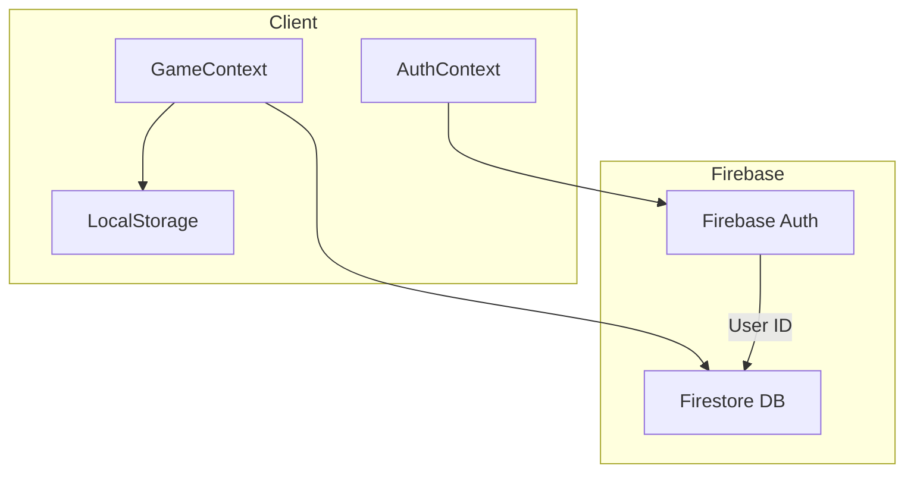

# Firebase Cloud Sync for IsoCity

## Overview

Add Firebase integration to enable user authentication and cloud-based city saves. Users can play anonymously, sign in with Google to sync across devices, and manage multiple cities stored in the cloud.

## Architecture



**Data Flow:**

- Anonymous users: Local storage only (existing behavior)
- Signed-in users: Cloud sync with Firestore, local storage as cache
- On sign-in with existing local data: Prompt user to merge or replace

## Firebase Project Setup

1. Create a new Firebase project via the Firebase MCP tools
2. Enable Authentication with Google and Anonymous providers
3. Set up Firestore database with security rules
4. Register a web app and get SDK config

## Implementation Steps

### 1. Firebase Configuration

Create [`src/lib/firebase.ts`](src/lib/firebase.ts) with Firebase initialization using environment variables for config. Install `firebase` npm package.

### 2. Authentication Context

Create [`src/context/AuthContext.tsx`](src/context/AuthContext.tsx) to manage:

- `user` state (Firebase User or null)
- `signInWithGoogle()` - Google popup sign-in
- `signInAnonymously()` - Anonymous auth
- `linkGoogleAccount()` - Link anonymous to Google
- `signOut()`
- `isLoading` state for auth initialization

### 3. Cloud Storage Service

Create [`src/lib/cloudStorage.ts`](src/lib/cloudStorage.ts) with functions:

- `saveCloudCity(userId, cityState)` - Save city to Firestore
- `loadCloudCities(userId)` - List user's cloud cities
- `loadCloudCity(userId, cityId)` - Load specific city
- `deleteCloudCity(userId, cityId)` - Delete a cloud city
- `renameCloudCity(userId, cityId, newName)` - Rename

**Firestore Structure:**

```javascript
users/{userId}/cities/{cityId}
    - cityName: string
    - population: number
    - money: number
    - year: number
    - month: number
    - gridSize: number
    - savedAt: timestamp
    - stateData: string (compressed JSON)
```


### 4. Update GameContext

Modify [`src/context/GameContext.tsx`](src/context/GameContext.tsx):

- Add `useAuth()` hook integration
- Add `syncToCloud()` function that saves to Firestore when signed in
- Modify auto-save interval to also sync to cloud (with debouncing)
- Add `cloudCities` state alongside `savedCities`
- Add `isSyncing` state for cloud save indicator

### 5. Merge/Conflict UI

Create [`src/components/game/SyncConflictDialog.tsx`](src/components/game/SyncConflictDialog.tsx):

- Shows when user signs in and has both local and cloud cities
- Options: "Keep Local", "Use Cloud", "Merge Both"
- Lists cities from each source with timestamps

### 6. Account UI

Create [`src/components/game/AccountMenu.tsx`](src/components/game/AccountMenu.tsx):

- Sign in / Sign out button
- User avatar and email when signed in
- "Link Google Account" for anonymous users
- Cloud sync status indicator

### 7. City Manager Updates

Update existing city management UI in [`src/components/game/SavedCitiesPanel.tsx`](src/components/game/SavedCitiesPanel.tsx) (or similar):

- Show cloud sync icon for synced cities
- Indicate local-only vs cloud-synced cities
- Add "Sync Now" button

## Security Rules

Firestore rules will ensure users can only read/write their own cities:

```javascript
rules_version = '2';
service cloud.firestore {
  match /databases/{database}/documents {
    match /users/{userId}/cities/{cityId} {
      allow read, write: if request.auth != null && request.auth.uid == userId;
    }
  }
}
```


## Key Files to Create/Modify